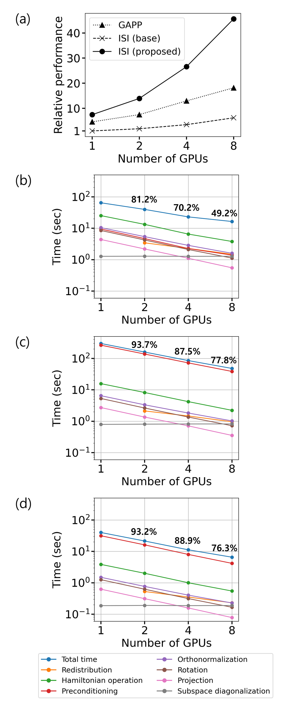

## Performance

### Comparison with State-of-the-Art Methods and Scalability 

> **Preconditions:**
> * Tests were conducted in the GPU environment proposed by [Woo et al. (2024)](https://doi.org/10.1021/acs.jctc.4c00721).
> * Dataset details are provided in [Woo et al. (2024)](https://doi.org/10.1021/acs.jctc.4c00721).

* Figure (a) shows the relative performances of block Davidson method with Inexact Shift-and-Invert(ISI) preconditioner and the modified ISI preconditioner with respect to Gaussian-Approximated Poisson Preconditioner(GAPP)
* The block Davidson method with the modified Inexact Shift-and-Invert(ISI) preconditioner outperforms other methods. 
* Figure (b)-(d) shows scalability of overall diagonalization with the diagonalization with three different preconditioners 
* The tested matrix used in all calculations is constructed by density functional theory for hBN system. Detailed explanations for the matrix is written in [Woo et al. (2024)](https://doi.org/10.1021/acs.jctc.4c00721)